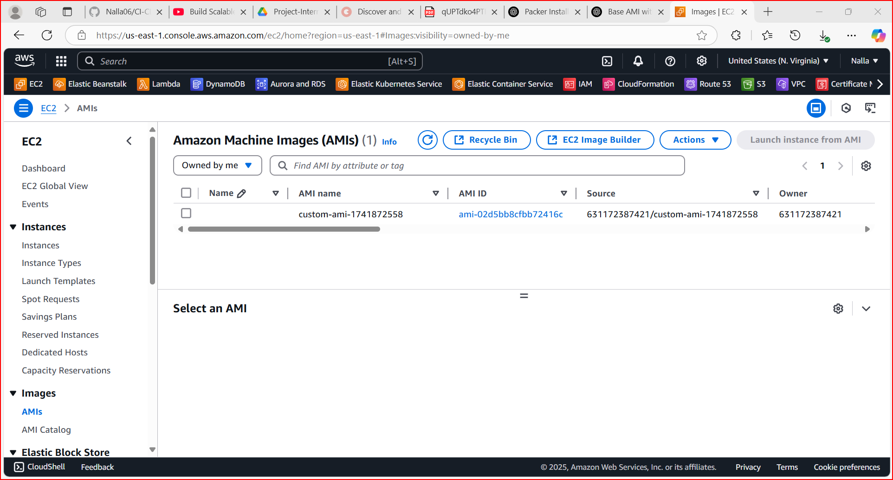
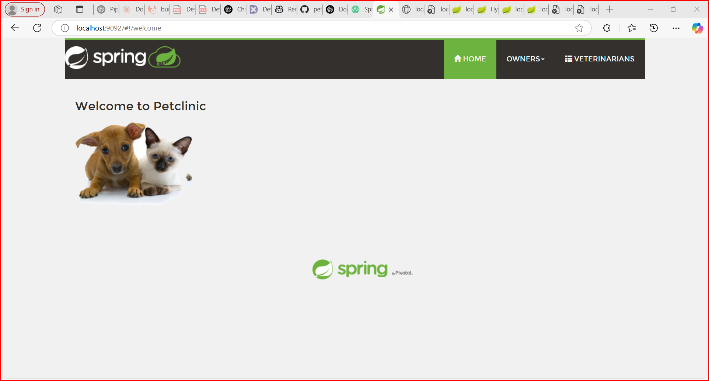
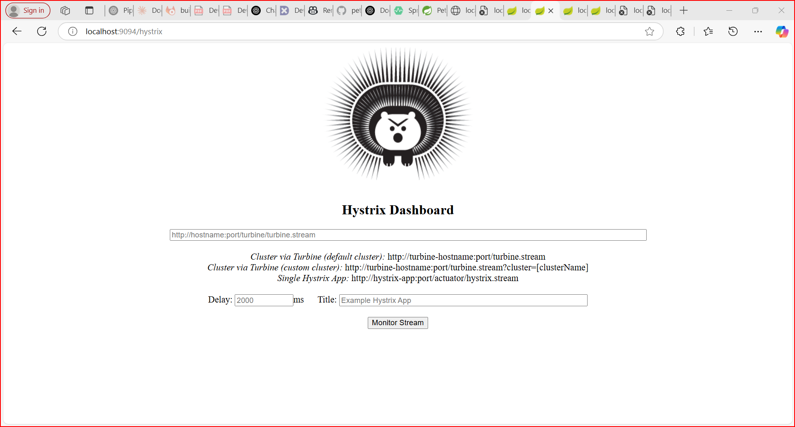
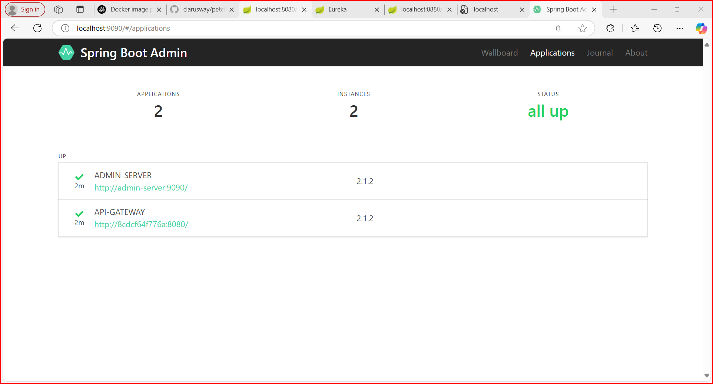
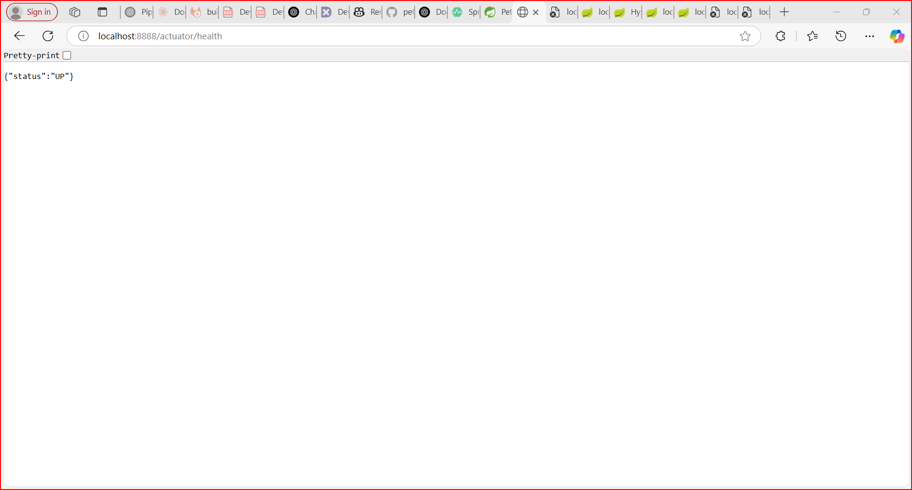
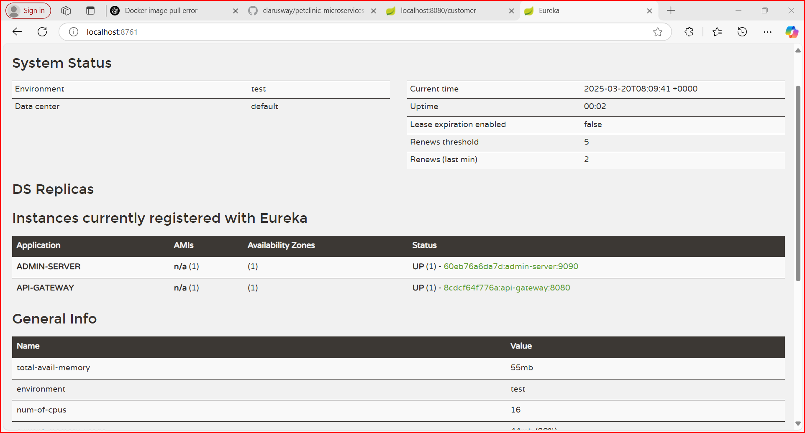

## Automated Deployment Pipeline with Packer, Terraform & AWS 

## 📌 Introduction
This project automates the deployment of a **Java-based application** using **Packer, Terraform, Docker, and GitLab CI/CD**. The pipeline follows Infrastructure as Code (IaC) principles to ensure efficient, repeatable, and scalable deployments.  

### **Key Technologies Used**
- **Packer** → Builds a **Golden AMI** with required dependencies.

- **Terraform** → Provisions AWS infrastructure (**VPC, ALB, ASG, RDS**).

- **GitHub & GitLab CI/CD** → Automates application build & deployment.

- **Maven** → Builds Java application (JAR/WAR).

- **Docker** → Containerizes the application for easy deployment.

- **CloudWatch & SSM Agent** → Enables logging & monitoring.

---

## Steps to Follow for the Project

### 📌 Part 1: Build a Golden AMI using Packer
1️⃣ Set up **Packer** on your local machine.  
2️⃣ Create a **Packer template** to build a custom AMI.  
3️⃣ Install required software (**Docker, Git, CloudWatch Agent, SSM Agent**) using shell scripts or Ansible.  
4️⃣ **Validate and build** the AMI using Packer.  
5️⃣ Store the **AMI ID** for future use.  

---

### 📌 Part 2: CI/CD Pipeline for Application Build & Deployment
6️⃣ Set up a **GitHub repository** for application code.  
7️⃣ Integrate **SonarCloud** for code quality scanning.  
8️⃣ Configure a **CI/CD pipeline** using GitHub Actions, Jenkins, or any CI tool.  
9️⃣ Build **JAR/WAR file** using Maven and store it in **JFrog Artifactory**.  
🔟 Build a **Docker image** and push it to **JFrog Artifactory**.  

---

### 📌 Part 3: Deploy Secure AWS Infrastructure using Terraform
1️⃣1️⃣ Create a **VPC** with Public, Private, and Secure subnets.  
1️⃣2️⃣ Deploy an **Application Load Balancer (ALB)** in the Public Subnet.  
1️⃣3️⃣ Configure an **Auto Scaling Group (ASG)** in the Private Subnet using the Golden AMI.  
1️⃣4️⃣ Deploy an **RDS database** in the Secure Subnet.  
1️⃣5️⃣ Configure **CloudWatch** for log monitoring.  

---

### 📌 Part 4: Automate Deployment
1️⃣6️⃣ Integrate **Terraform** with the CI/CD pipeline to provision AWS infrastructure.  
1️⃣7️⃣ Deploy the application automatically on **EC2 instances** using user data scripts.  
1️⃣8️⃣ Verify deployment by accessing the application via **ALB DNS**.  

---

## Images
Here are some images related to the deployment process:

.
.
.
.
.
.

